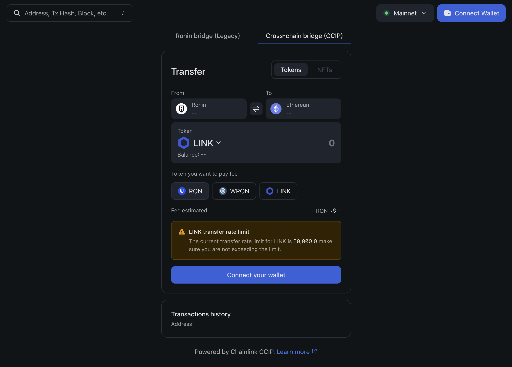
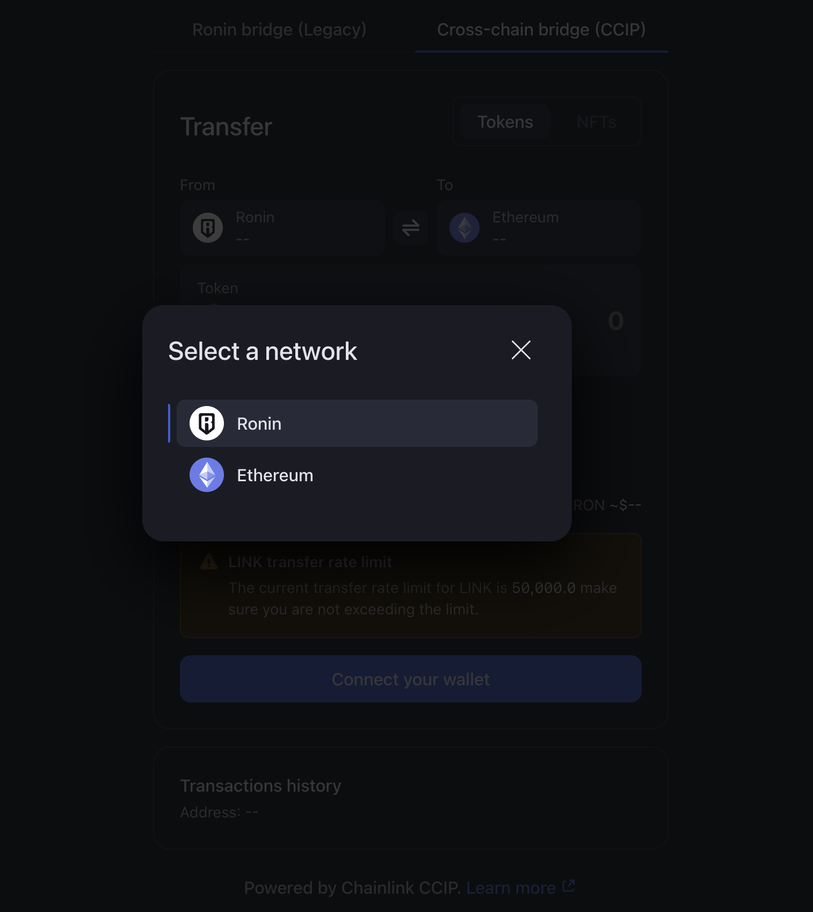
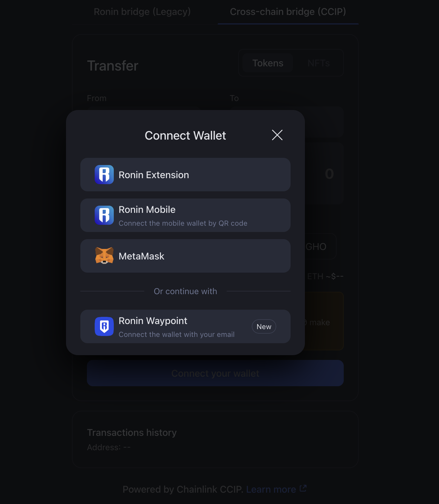
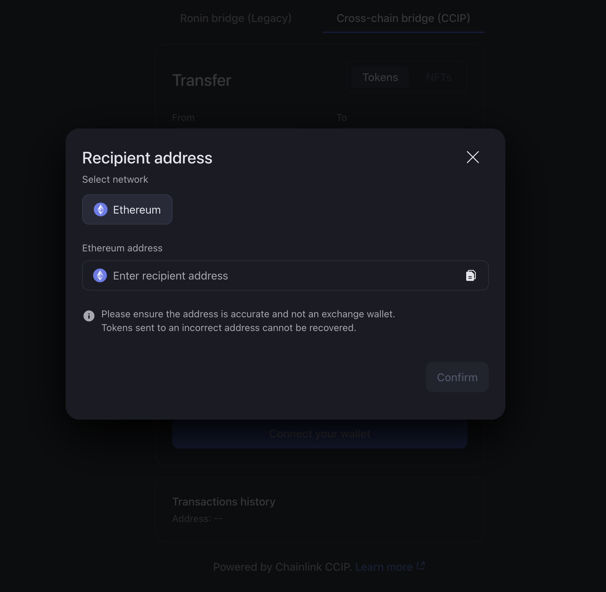
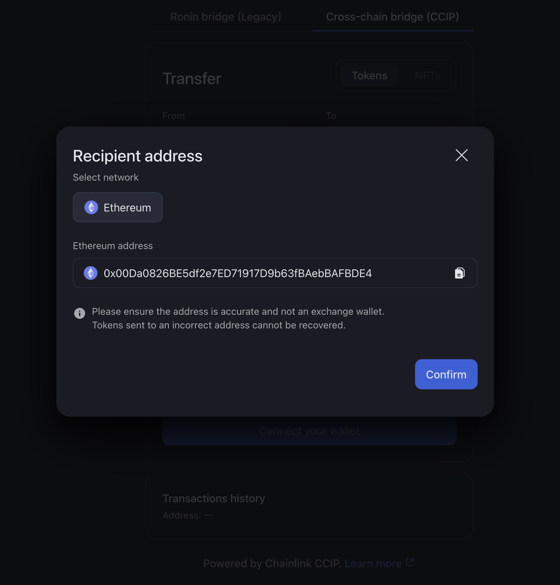
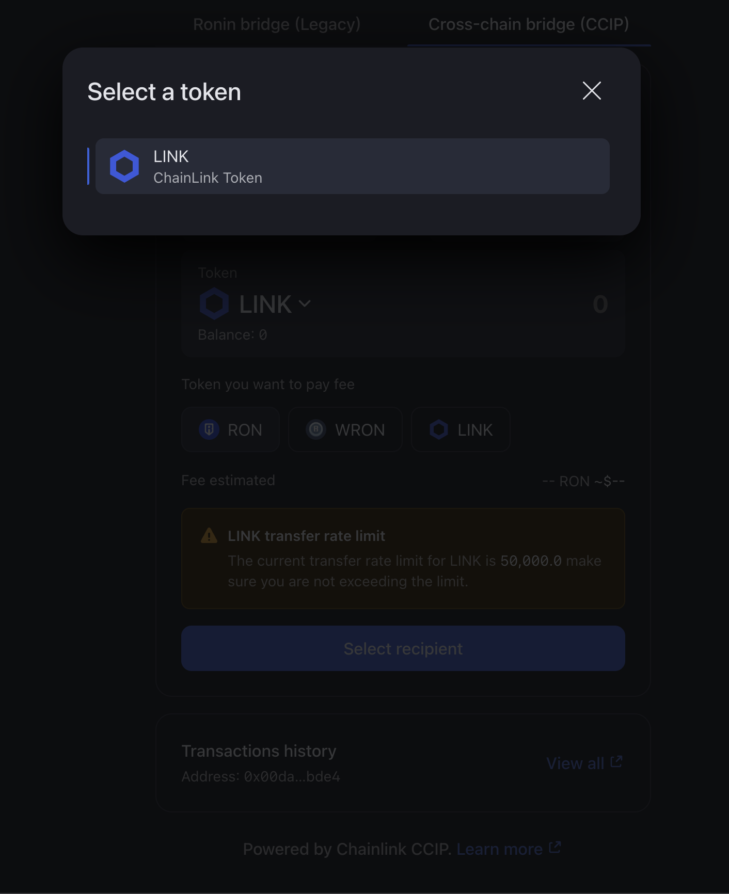
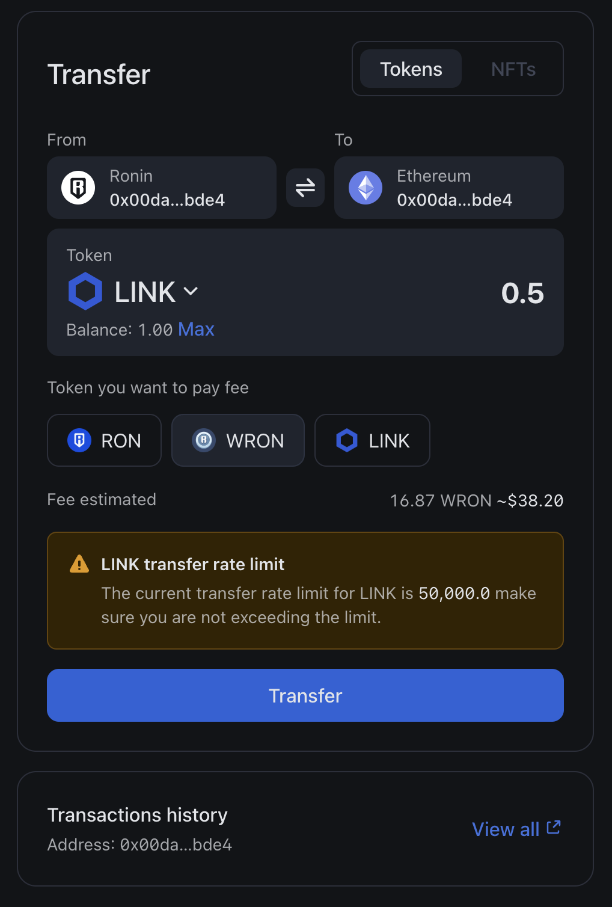
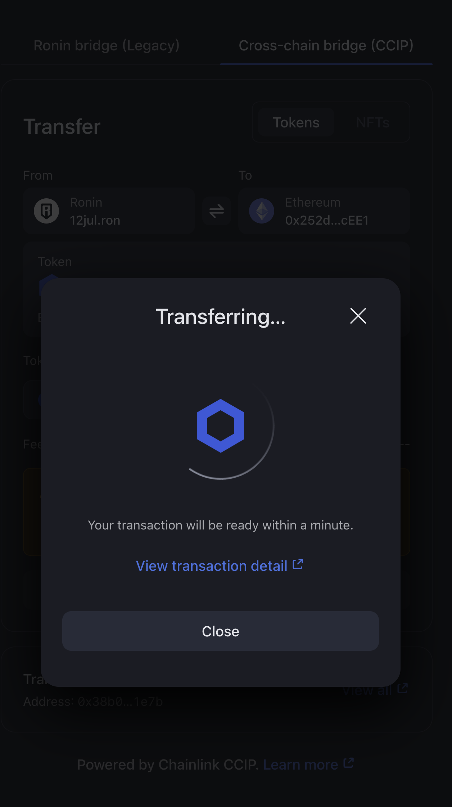
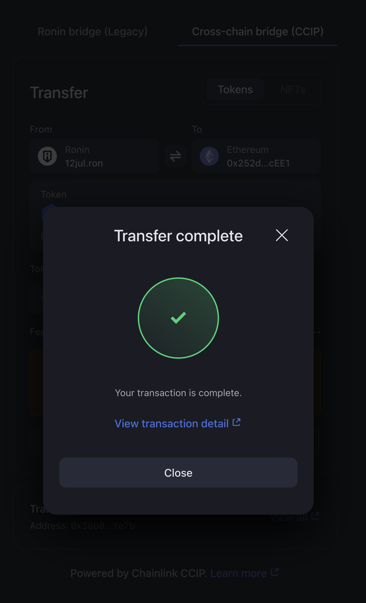

## Overview

This guide describes how to use CCIP Bridge to send an ERC-20 token from Ronin to Ethereum.

:::info
If you are a developer and want to learn more about the token requirements, please visit [this guide](/developers/tools/ccip).
:::

## Prerequisites

If you access CCIP Bridge on mobile, remember to import your Ethereum address to your mobile Ronin Wallet. To learn how to do that, see [Importing Your MetaMask Wallet to Ronin Wallet](https://support.roninchain.com/hc/en-us/articles/14862812718107-Importing-Your-MetaMask-Wallet-to-Ronin-Wallet).

## Step 1. Choose source and destination chain
   Go to https://app.roninchain.com/bridge, then select “Cross-chain bridge (CCIP)” tab

   

   Click “From" section, then select "Ronin" as the source chain
   - You can also click the “Swap” button to switch between source network and destination network at “From" and "To" boxes.

   

   Select the connection method you want to use and connect your Ronin wallet

   

   Click “To" section and choose the destination chain: "Ethereum"

   

## Step 2: Add the sender and recipient addresses
   Enter the recipient address or paste the address by clicking the “Paste" button, then click "Confirm" button
   - If the destination chain is Ronin, you can enter any RNS domain name that a wallet has.

   

## Step 3: Choose the token and amount
   Select the token and an amount you would like to transfer

   

## Step 4: Choose fee token
   Select the token you want to pay fee. Make sure you have enough token to pay fee.

   

## Step 5: Execute and receive the tokens in your  wallet
   Click “Transfer” button to execute the transaction 

   

   When the transaction is complete, you’ll see the “Transfer complete" window 

   